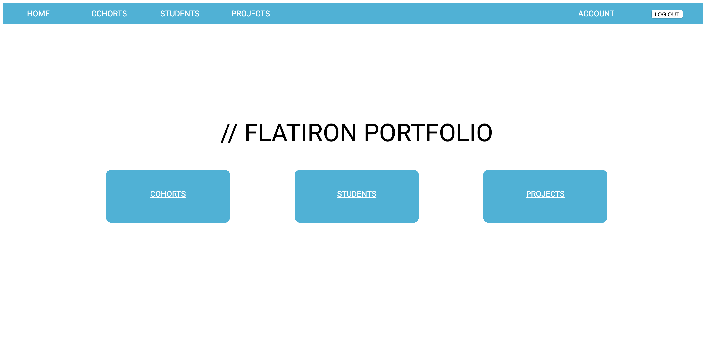
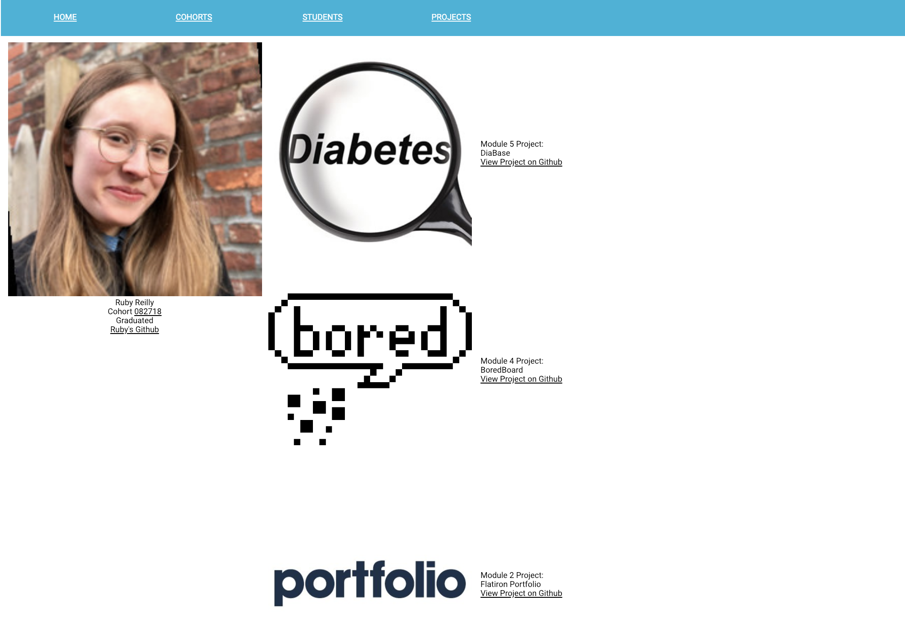

# Flatiron Portfolio
Ruby on Rails web app built to encourage project sharing among the community of learners and creators at the Flatiron School.
+ Implemented backend structure and frontend routes using Ruby on Rails (Ruby version 2.5.0)
+ Created user interface with HTML and CSS
+ Used object oriented Ruby and MVC for organization and structure
+ Utilized Bcrypt for authorization and authentication
+ Developed using git branching for project management



## Development Setup
Run the rails API with

```bash
bundle install
rails db:create
rails db:migrate
rails db:seed
rails s
```

## Usage Example



+ Users can make an account with a secure password
+ Users can edit their account information
+ Users can add, delete, and edit projects with an image and link to GitHub repo
+ Users can browse other users' projects


## Contributing
1.  Fork it (https://github.com/rubyreilly/flatiron-portfolios/fork)
2.  Create your feature branch (`git checkout -b feature/fooBar`)
3.  Commit your changes (`git commit -m 'Added fooBar'`)
4.  Push to the branch (`git push origin feature/fooBar`)
5.  Create a new Pull Request

## Contributors
+ Ruby Reilly
+ Jordan Martin

## Contact
Ruby Reilly – [my github](https://github.com/rubyreilly) – [rubyclaroreilly@gmail.com](mailto:rubyclaroreilly@gmail.com)
